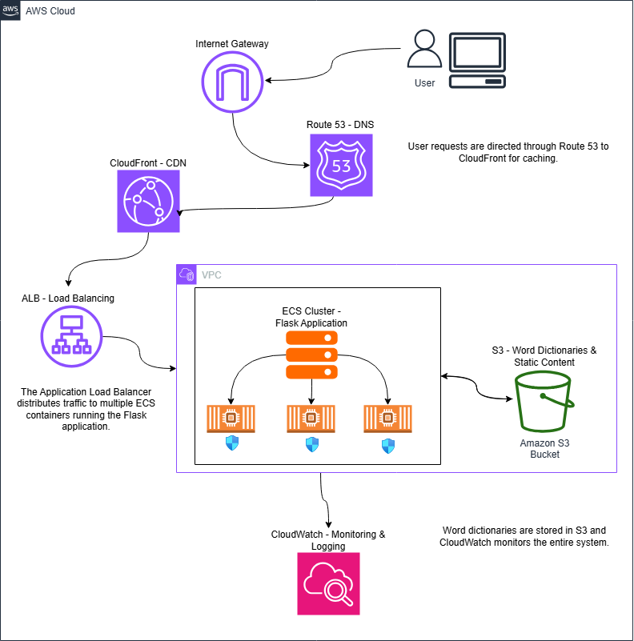
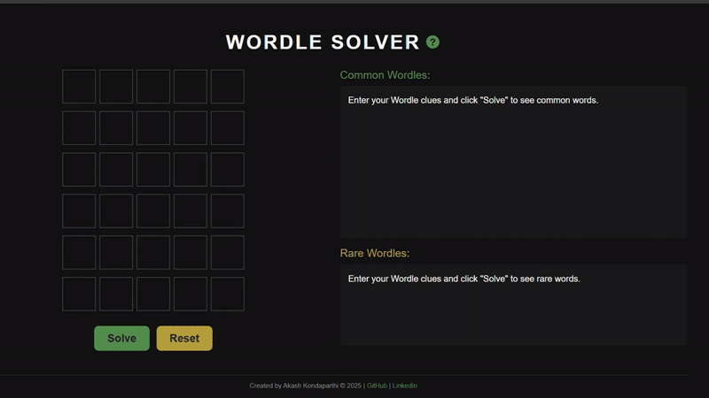

# Wordle Solver

A web application that helps users solve the popular Wordle word puzzle game by providing suggestions based on their current clues.

## Features
- Interactive grid interface that mimics the original Wordle game
- Color-coded letter classification (green, yellow, gray)
- Separate lists for common and rare words
- Responsive design for mobile and desktop
- Keyboard shortcuts for faster operation

## Technologies Used
- **Backend**: Python, Flask
- **Frontend**: JavaScript, HTML5, CSS3, Bootstrap
- **Deployment**: [Website](https://akashkk25.github.io/WORDLE-Solver-GHP/)
- **Architecture**: AWS-ready design (see below)

## AWS Architecture
This application is designed with a production-ready AWS architecture in mind. While currently deployed on GitHub Pages, the application is architected to scale on AWS using the following services:



Key AWS components:
- **Route 53** for DNS management
- **CloudFront** for global content delivery
- **ECS** for containerized application hosting
- **S3** for static assets and dictionary storage
- **CloudWatch** for monitoring and logging

For detailed AWS deployment information, see [aws_deployment.md](aws-deployment.md).

## Installation and Local Setup
1. Clone the repository
2. Install dependencies: `pip install -r requirements.txt`
3. Run the application: `python app.py`
4. Open `http://localhost:5000` in your browser

## Usage
1. Enter a guess word in the Wordle game
2. Input the same word in the solver
3. Click on letters to cycle through their states (gray, yellow, green)
4. Click "Solve" to see suggested words
5. Continue refining with additional guesses

## Project Structure
```
wordle-solver/
│
├── app.py                 # Flask application
├── WORDLE_Dictionary.txt  # Word dictionary
├── requirements.txt       # Python dependencies
├── aws_config.py          # AWS configuration (for documentation)
├── aws_deployment.md      # AWS deployment documentation
│
├── static/
│   ├── css/
│   │   └── styles.css     # Application styling
│   └── js/
│       └── script.js      # Frontend functionality
│
└── templates/
    └── index.html         # Main application page
```

## Demo



## Live Demo

A static version of this application is deployed on GitHub Pages:
[Wordle Solver Live Demo](https://akashkk25.github.io/WORDLE-Solver-GHP/)

Note: The live demo uses a client-side implementation for solving, while the original Flask application provides more comprehensive word filtering.

## Contact
Akash Kondaparthi - akashkondaparthi@gmail.com
